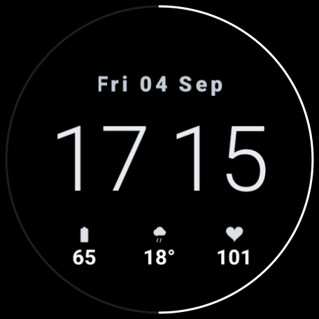
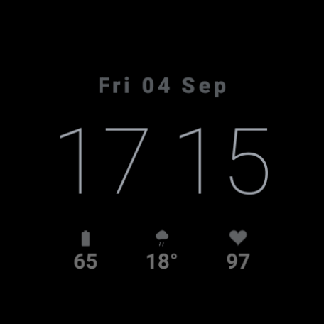

# Graphite

A greyscale digital watch face for Wear OS, built in [Watch Face Format](https://developer.android.com/training/wearables/wff) (WFF). Targets Pixel Watch 3 on Wear OS 7, and installs on anything from Wear OS 5 up.

| Interactive | Ambient |
|---|---|
|  |  |

Both are real captures from a Pixel Watch 3. The small dot at the bottom is Wear OS's own unread-notification indicator, not part of the face. Ambient drops the seconds arc and the rail, thins the time and dims the rest.

Black ground, a single grey ramp, and no colour anywhere. With no hue to lean on the hierarchy is carried by brightness alone, so pure white is reserved for a single accent, the seconds arc, and the time itself sits one step below.

- **Time** in 24-hour, with no separator: hours and minutes are two elements either side of a 26px gutter.
- **Seconds** sweep as a white arc on a dim outer rail.
- **No notification dot of its own.** Wear OS already draws one, low and centred; a second at 12 o'clock just doubled it.
- **Tap the date** to open the calendar.
- **Bottom row of three**: a battery slot, the current temperature, and a heart rate slot. The outer two are swappable complications.
- **Weather glyph** follows the actual conditions, with separate day and night sets.
- **Live moon phase** when the night sky is clear, tracking the real lunar cycle.
- **Ambient** drops the arc, rail and rule, thins the time and dims everything else.

## Build

No Gradle. A WFF bundle is resources only (`hasCode="false"`), so `aapt2` and `apksigner` from the SDK build-tools are the whole toolchain, which keeps the build a couple of seconds and free of AGP version pinning.

```bash
./build.sh                              # build build/graphite.apk
./build.sh install                      # build, then install on the only device
./build.sh install -s emulator-5554     # ... on a specific one
```

Pin `-s` whenever anything else is adb-connected. Any other adb-reachable device on the network shares the adb server and will happily answer instead of the watch.

The APK is **debug-signed**, with the standard Android debug keystore (`~/.android/debug.keystore`, password `android`), generated on first build if absent. That is fine for sideloading onto your own watch and nothing else: it is not a release key, no signing material is in this repo, and publishing to Play would need a real upload key.

## Running it

```bash
# Wear OS 7 emulator, created once
$ANDROID_HOME/cmdline-tools/latest/bin/sdkmanager \
  "system-images;android-37.0;android-wear-signed;arm64-v8a"
$ANDROID_HOME/cmdline-tools/latest/bin/avdmanager create avd \
  -n PixelWatch3_WearOS7 \
  -k "system-images;android-37.0;android-wear-signed;arm64-v8a" \
  -d wearos_large_round
$ANDROID_HOME/emulator/emulator -avd PixelWatch3_WearOS7

# make it the active face
adb -s emulator-5554 shell am broadcast \
  -a com.google.android.wearable.app.DEBUG_SURFACE \
  --es operation set-watchface \
  --es watchFaceId com.teceno.watchface.graphite
```

`--es watchFaceId <package>` is the form that works. Passing `--ecn component <pkg>/<service>` fails with "Watch face package is not installed", because a WFF face declares no service of its own: the system's `com.google.wear.watchface.runtime` renders it.

To put it on the real Pixel Watch 3, enable ADB debugging and wireless debugging in developer options, `adb pair` then `adb connect`, and run `./build.sh install -s <watch>`. The watch has to be on the same network as this machine; both sat on the house mesh for this. See **Verified on hardware** below for the pairing sequence.

## Preview image

`src/res/drawable/preview.png` is what the picker and Play show, so it is a real capture rather than a mockup. Set the face active, then:

```bash
tools/grab_preview.sh emulator-5554
./build.sh
```

## Things worth knowing

Notes from getting this working, so they don't have to be rediscovered.

- **Complication defaults only apply the first time the face is added.** `DefaultProviderPolicy` is read when the face becomes a favorite, so a plain `install -r` after changing the defaults leaves the old, empty configuration in place and the slots render blank. `adb uninstall` first, then install and re-set the face.
- **A literal space in a `TimeText` format string makes the element render nothing.** `format="hh mm"` produces no time at all, silently, with nothing in logcat. Two elements with `format="hh"` and `format="mm"` is the way to drop the colon.
- **`Arc` angles are floats, not expressions.** The `angleType` in the v3 schema does not accept `[SECOND] * 6` in `endAngle`. Drive it with a child `<Transform target="endAngle" value="[SECOND] * 6"/>` instead.
- **A literal `♥` gets claimed by the colour emoji font** and renders as a red blob, which is why the heart is a tinted PNG. `tools/make_heart.py` draws it white; the grey is applied by `tintColor` in the face, so the palette stays in one file.
- **`<Outline>` is silently ignored by the runtime.** It is in the schema from v1 and packages into the APK fine, but a `width="4" color="#ffff0000"` outline on the date rendered nothing at all on the watch. Assume the other text decorations (`Shadow`, `OutGlow`) are equally untrustworthy until proven otherwise.
- **The device font's weight ladder tops out around BOLD.** Going `BOLD` to `BLACK` bought only about 10% more stroke.
- **Do not faux-bold by stacking offset copies.** With `<Outline>` dead and `BLACK` nearly exhausted, drawing the text four times at 1px offsets does thicken the stroke (+47%), but every overlapping antialiased edge softens the one beneath it and the result reads visibly blurry on the watch. Get weight from font size instead: a single draw at a larger size is both heavier and sharp. The date is one `PartText` at size 30 for exactly this reason.
- **Measure the face, don't eyeball it.** Styling changes that are obvious in a diff can be invisible on a 456px screen. Counting lit pixels in a region across two screenshots turns "looks the same" into a number.
- **A screenshot of a dozing watch is an ambient frame, and measures completely differently** (the date drops to alpha 130). The watch re-enters ambient within seconds of a wake keyevent, so a capture has to be gated on `dumpsys activity service com.google.android.apps.wearable.systemui | grep mAmbientState` reporting `NOT_IN_AMBIENT`, or the numbers are nonsense. This burned two measurement rounds.
- **`tintColor` multiplies, it does not replace.** A white source multiplies cleanly to whatever grey you name, but Google's heart-rate complication icon is already red, so tinting it grey lands on a dark red (measured 116,40,45 on the watch) with no way to neutralise it. That is why the right slot always draws its own white `ic_heart.png` instead of the provider's icon. The battery icon in the left slot is white at source, so the provider's own image tints correctly.
- **The `[HEART_RATE]` data source reads 0 on the emulator**, with or without `BODY_SENSORS` granted, even while logcat shows `DWF:WearHealthProvider` receiving samples, and `adb emu sensor set heart-rate 72` does not change that. The `HEART_RATE` complication provider does return live values, which is why heart rate goes through a slot here.
- **`res/raw/watchface.xml` must stay plain text** in the APK, since the runtime reads it with `openRawResource()`. `aapt2` leaves `raw/` alone, and `build.sh` asserts it.
- **Weather and moon phase are native to WFF, no complication slot needed.** `[WEATHER.TEMPERATURE]`, `[WEATHER.CONDITION]` and `[MOON_PHASE_TYPE]` come straight from the runtime with no manifest permission. Guard weather with `[WEATHER.IS_AVAILABLE]`: it genuinely reads false for a while after install, until the watch's weather source first fetches, and without the guard you get a bare `0`.
- **A BitmapFont turns an enum into an icon lookup.** `[WEATHER.CONDITION]` is 0-15 and `[MOON_PHASE_TYPE]` is 0-7, so declaring a `<BitmapFont>` whose character names are those numbers lets the value index the glyph directly, instead of a sixteen-branch `Condition` chain. **Names 0-9 must be `<Character>` but 10-15 are two characters each and must be `<Word>`** - get that wrong and those conditions silently render nothing.
- **Moon phases are computed, not drawn.** The terminator of a lit sphere projects to an ellipse, so the boundary at height y sits at `x = k*sqrt(1-y^2)` with `k = 1-2*illuminated`. That yields new through full continuously and mirrors correctly for waning. Google's eight `MOON_PHASE_TYPE` bands are coarse though: a 46%-lit moon still reports Morning Crescent. `[MOON_PHASE_POSITION]` gives 0-28 days if you want finer fidelity.
- **Bare symbols beat cloud-plus-detail at 26px.** Snow as a flake and thunderstorm as a bolt read instantly; the same conditions drawn as a cloud with strokes or a small bolt beneath mushed together. Check glyph ink boxes against each other, since a shape can be nominally 26px and still render 18px of actual ink.
- **`cmd alarm set-timezone <tz>` shifts the clock without root**, which is the way to test time-dependent rendering on a production Wear image where `adb root` is refused. Verifying 24-hour output at 09:00 is impossible because both formats render `09`; pointing the emulator at `Europe/London` made it 16:09 and settled it in one shot.
- **Shell-injected notifications do not raise `UNREAD_NOTIFICATION_COUNT`.** `cmd notification post` creates records that `dumpsys notification` lists but the count still reads 0, a condition on it cannot be verified on the emulator. It does fire on the watch, confirmed on hardware before the dot was removed as redundant.

## Verified on hardware

Pixel Watch 3 45mm (`sol`), Wear OS 7 / Android 17 / API 37, 456x456, over wireless ADB: interactive and ambient renders, live battery and heart rate, the seconds sweep, 24-hour output, complication tap targets, and the date tapping through to Google Calendar. Ambient measures 4.6% lit pixels (mean luminance 5.1/255) against 10.2% interactive, well inside the always-on burn-in guidance. Layout also checked at 384x384 via `wm size` for the 41mm.

Wireless debugging needs a **one-time pairing per host**, which is separate from the toggle. The pairing port is ephemeral and only advertised while **Settings → Developer options → Wireless debugging → Pair new device** is open:

```bash
adb mdns services | grep pairing     # read the pairing IP:port
adb pair <ip>:<pairing-port> <6-digit code>
adb connect <ip>:<connect-port>      # the _adb-tls-connect port, a different one
```

## Layout

Positions are on the 450x450 virtual canvas, which the runtime scales to the device (384x384 on the 41mm, 456x456 on the 45mm).

| y | element |
|---|---------|
| 98 | date, 30px BLACK, taps through to the calendar |
| 155 | time, 128px, in a 140px band centred on 225 |
| 318 | bottom row, three 96x62 cells at x=71, x=177 and x=283 |

## License

MIT. See [LICENSE](LICENSE).
